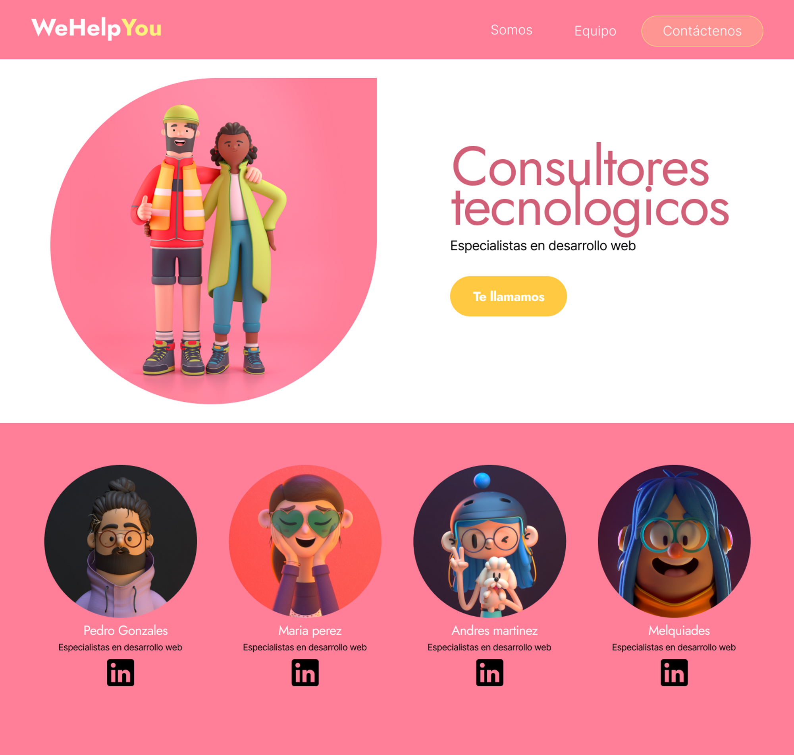
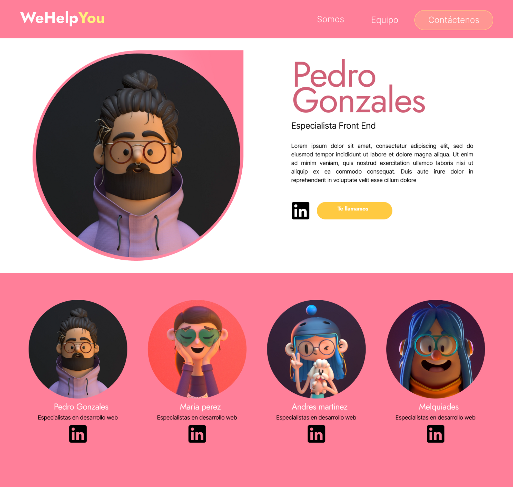
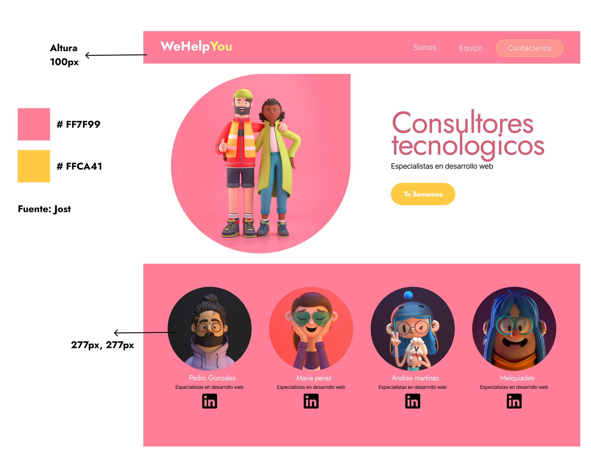

# PROYECTO CODERSTEAM
Proyecto colaborativo en equipo sobre diseñar una web para nuestra empresa ficticia mediante unas plantillas orientativas de la misma.

<h2>Plantillas e instrucciones</h2>
<ul>
<li>Landing page</li>

<li>Profile page</li>

<li>Instrucciones del proyecto</li>

<h2>Colaboradores del proyecto</h2>
<ul>
<li>Borja Fernández (BarmanDev):

https://github.com/BarmanDev</li>

<li>Alejandro Junquera (AlejandroJuGon):

https://github.com/AlejandroJuGon</li>

<li>Álvaro Sánchez (Alvarosc15):</li>

https://github.com/Alvarosc15

<li>Sara Lorenzo (SaraLorenzoCal):

 https://github.com/SaraLorenzoCal</li>
